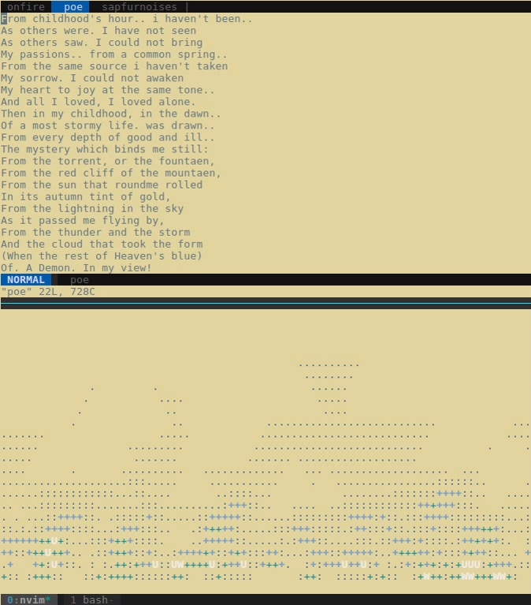

# saphur-noises

## WhatIsIt
It's a bucnh of shell scripts to let my notebook compose almost all it wants:
making ambient sound of wind and sea noises;
reading E.A Poe's poem;
singing random bits in two voices;
drawing sort of waves.

## WhatToDo
Install SoX
Install Festival package
Check aplay player (or replace it)

## SpecialThanksTo
Centre for Speech Technology Research (CSTR) at the University of Edinburgh
Chris Bagwell
BruXy and Robert Elder
HP, ALSA, AWK, PRNG, E.A.Poe
